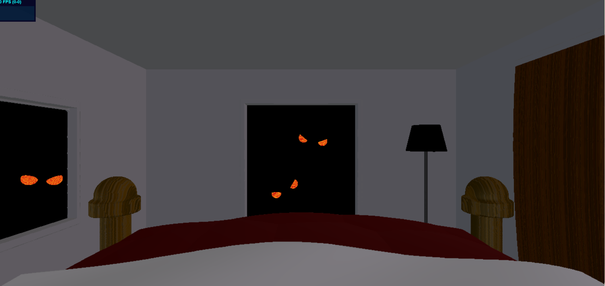

# Implicit Surfaces
**By Janine Liu / jliu99**

# External Resources

In addition to the class lectures and powerpoints, I consulted a few external resources for this project:
- http://www.iquilezles.org/www/articles/distfunctions/distfunctions.htm, for a list of signed distance functions.
- https://iquilezles.org/www/articles/rmshadows/rmshadows.htm, for how to implement raymarched shadows.
- https://www.shadertoy.com/view/MdXSWn, lines 196-199 for inspiration with post-process color-mapping.
- http://www.iquilezles.org/apps/graphtoy/, for figuring out what functions to use in this scene.

# Live GitHub demo
https://j9liu.github.io/hw3/

# Modeling

The room is comprised of thin box SDFs that act as the walls and ceiling. Each of the side walls also has its own "cutout" (window, door, etc) with a noticable frame that is smoothly unioned with the rest of the wall.

The bed is another set of box SDFs bent in the x direction, while the bedposts are spheres smoothly unioned with short cylinders, unioned with longer cylinders for the poles.

The bed is positioned such that the viewer is overlooking the foot of it, as though they are sleeping in the bed themselves.

To make the bedsheets appear less more believable, I applied Worley noise to the bedsheet to give it a quilted pattern. I had to nest this noise into a cosine function in order to smooth out the pointy lumps that result where the Worley points are placed in the sheet. The white top of the bedsheet was also deformed by a cosine function, which made the fabric more wavy and believable.

The lamp was modeled using capped cones subtracted from each other, unioned with a cylinder smoothly connected to a capped cone at the bottom.

I added a door to the right wall that bent over time such that it appeared to be violently knocking using a sawtooth wave. However, because the FPS of this scene is very low, this animation is not very effective. Last but not least, the pairs of eyes staring at the viewer were made from a hemisphere that comes from the intersection of a sphere and box SDF, rotated and duplicated across the x-axis.

# Lighting and Textures

There are two directional lights in the scene tinted with hues of blue and purple, which represent faint light perceived when the lights are off at night.

A point light is also positioned inside the lamp and acts as a yellow, artificial light source for the rest of the scene. This light also causes objects to cast soft shadows, unlike the directional lights. Additionally, this light flickers based on a square wave function that takes in the time.

The wooden textures of the door and bedposts were made by multiplying the point's coordinates by a significant scalar, inputting them into an FBM function, then taking the fractal component of the noise as a t-value for wood-colored cosine palette. The resulting value of this palette was then tuned to blend in better with its respective wood color.

The lampshade uses a subsurface scattering material to glow. Additionally, the eye colors are an interpolation between a bright red and orange that is influenced by the noise at those point coordinates.

# Post Process

To add more atmosphere, a subtle vignette was applyed across the entire screen. The vignette without the scene's colors is shown below.

In addition, the final colors of the scene were remapped to an arctan curve to increase the contrast. The blue is also intensified whenever the light is off, so that the scene appears darker and more intense. Finally, to better fit the ambience of each lighting setup, the eyes were made to only appear whenever the lamp was off. This results in our final scene with two distinct stages:

