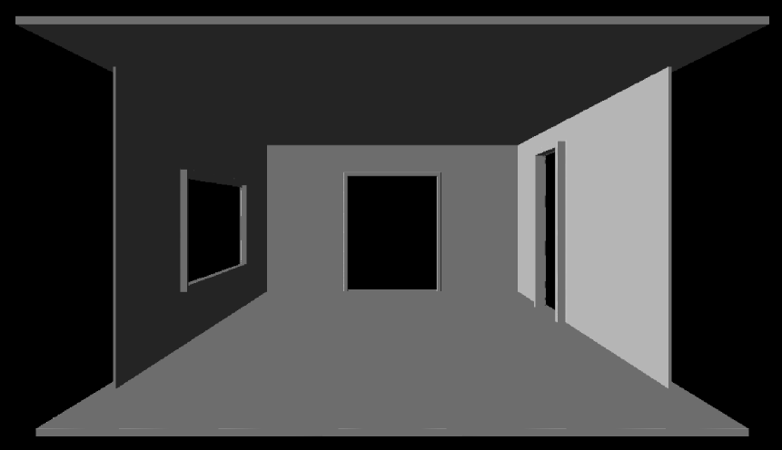

# Implicit Surfaces
**By Janine Liu / jliu99**

# External Resources

In addition to the class lectures and powerpoints, I consulted a few external resources for this project:
- http://www.iquilezles.org/www/articles/distfunctions/distfunctions.htm, for a list of signed distance functions.
- https://iquilezles.org/www/articles/rmshadows/rmshadows.htm, for how to implement raymarched shadows.
- https://www.shadertoy.com/view/MdXSWn, lines 196-199 for inspiration with post-process color-mapping.

# Live GitHub demo
https://j9liu.github.io/hw2/

# Model Features

The room is set up with thin box SDFs that act as walls. 

# Light and Texture Features

